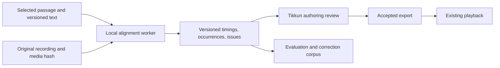

# Torah Audio Aligner

**Recommendation: proceed with a local, assisted alignment beta.** Tikkun has enough real recordings, synchronized cues, and editing infrastructure to test this economically. The first product should turn a selected Torah passage and recording into reviewable word timings, preserve uncertainty and reading events, then export accepted results into Tikkun. Automatic pronunciation assessment and musical taamim assessment should develop behind separate evaluation gates.

The distinctive work belongs in the Torah text mapping, handling of reading deviations, timing integrity, and correction workflow. An existing Hebrew acoustic model can provide the initial sound evidence. A single local process and versioned files are sufficient for the first beta; a production job service, distributed workers, and database are later operational choices.

**Feasibility is supported; acoustic performance remains unmeasured.** The repository checks below validate the available data and integration contracts. They do not establish word-boundary accuracy, robustness to another reader, or pronunciation detection accuracy. The proposed pilot is the next decision point.

**Existing assets and their actual limits.** The working-tree inventory contains 70 locally available recordings, totaling 19,176.09 seconds (5.33 hours) and 284,472,879 bytes (271.29 MiB). All 70 files match their manifest SHA-256 digest and byte length. All are mono, with AAC or MP3 audio at 44.1 or 48 kHz. The corpus currently identifies one narrator, Yoni Davidov.[^1]

| Asset or check | Verified result | Consequence |
|---|---:|---|
| Published cue files | 63 | File count alone overstates useful supervision |
| Nonempty cue files | 44 | 3.45 hours of associated recordings |
| Empty cue files | 19 | No timing labels to learn from |
| Saved cue starts | 8,646 | Useful initial alignment supervision |
| Unique cued display tokens | 8,646 | No duplicate token coverage in these cue files |
| Saved word ends | 0 | True acoustic ends require new annotation |
| Nonempty files beginning at time zero | 44 of 44 | First starts require special treatment |
| Files with media identity | 63 of 63 | Existing provenance is stronger than an optional schema field suggests |
| Published recording issues | 5 | Four pronunciation notes, one other note; no labeled repeat/restart examples |
| Structural parser failures | 0 | Existing payloads satisfy the current published contract |
| Nonempty cue/text sequence mismatches | 0 | Every cued sequence matches current canonical reading tokens |
| Cues beyond recording duration | 0 | Basic media bounds pass |
| Cues containing maqaf | 1,356 | A display cue can cover several lexical words |

Nonempty coverage is Beresheet (1,686 cues), Noach (1,580), Lech-Lecha (1,460), Toldot (1,283), Vayetzei (1,775), Haazinu (542), and Yitro aliyot 1-2 (320). Behalotecha and Nasso cue files are empty, as are Yitro 3-7. These are artifact counts, independent of manual workflow labels.[^1]

Five distinctions matter before using this corpus as training data:

1. **Playback start is not necessarily speech onset.** The editor seeds the first cue at zero, and export applies `normalizeFirstCueStart`. All 44 populated files have this property. Preserve these originals as legacy playback annotations; re-annotate first acoustic onsets in the evaluation subset. Do not teach the model that a word must begin at media time zero.[^2]
2. **Manual synchronization is not automatically phonetic ground truth.** Other cue starts may include operator reaction delay or an intentional visual lead. Measure signed timing error on manually reviewed samples before applying any correction. A universal offset cannot be inferred from the files alone.
3. **Display tokens and lexical words differ.** Splitting the cued display strings at maqaf produces 10,049 units, versus 8,646 existing cues. That is a tokenization diagnostic, not 10,049 independently labeled word boundaries. Interior maqaf boundaries are currently unlabeled.[^1][^3]
4. **A second reader is essential for generalization claims.** Holding out aliyot from Yoni is useful for passage generalization, but cannot establish accuracy on an unseen voice, pronunciation tradition, microphone, or learner.
5. **The issue taxonomy exceeds the labeled examples.** Existing issue types are valuable for UI and schema reuse. Five notes cannot train or evaluate a robust mistake detector.[^4]

**What the supplied research establishes, and what to change for beta.** Its separation of alignment, pronunciation, and cantillation is sound. Preserve immutable media identity, separate occurrences from canonical words, and keep human corrections distinct from model output. Its full production program also includes infrastructure and research tracks that need not precede useful automatic cue drafting.[^5]

The beta can use one Hebrew CTC model first, with optional ASR only where it improves anchoring. CTC produces a sequence of acoustic scores over time; these can support both rough text matching and detailed alignment. Starting with a mandatory two-model pipeline would add download, memory, and maintenance costs before its benefit is measured.

Two claims need particular care. First, a richer occurrence schema does not itself make the current player handle repeats correctly. Second, native Modern Hebrew recognition does not establish Torah pronunciation correctness. Those limitations remain even when a transcript looks convincing.

There is direct research precedent for Torah-specific alignment. Ben-Shalom, Keshet, and Yeger-Granot adapted a phoneme aligner to Yemenite cantillation by changing duration modeling and its acoustic classifier. Their experiment reports 85.9% of phoneme boundaries within 60 ms. Its small, narrowly evaluated corpus makes it evidence that adaptation is possible, not a forecast for Tikkun or unfamiliar readers.[^6]

**Components to reuse.** The following selection favors explicit evidence and a small runtime. License labels below describe the inspected artifacts; they are not blanket conclusions about every dependency or training source.

| Candidate | Practical role | Assessment |
|---|---|---|
| `imvladikon/wav2vec2-xls-r-300m-lm-hebrew` | First Hebrew CTC checkpoint candidate | Its card declares Apache-2.0. Load acoustic logits without the external language-model decoder; verify tokenizer/config compatibility. Torah performance is unmeasured.[^7] |
| WhisperX alignment module | Comparison baseline and alignment reference | Accepts supplied text segments. Current Hebrew default is the separate non-LM checkpoint. Its interpolation must remain distinguishable from acoustically supported timings. Code is BSD-2-Clause.[^8] |
| `ctc-segmentation` | Small decoder/segmentation baseline | Apache-2.0; consumes CTC emissions from an existing model and yields alignments and scores. Its scores need calibration; it is not a complete repeat-aware Torah engine.[^9] |
| ivrit.ai Whisper turbo | Optional recovery/phrase anchors | Hebrew adaptation, Apache-2.0 model card. Benchmark its incremental value against the CTC-only path.[^10] |
| Phonetic MAM | Biblical pronunciation references and test cases | Published Sefardic and Ashkenazic outputs, with CC-BY-SA 4.0 indicated on the project site. Public repository now contains generated material; its generator is private. Reuse data selectively, not an assumed available G2P engine.[^11] |
| Phonikud | Modern Hebrew G2P techniques and experiments | CC BY 4.0 code. Its text-to-phoneme output describes expected pronunciation, not what a recording contained. Keep its representation isolated from Torah text.[^12] |
| PocketTorah | Potential additional audio/timing corpus | Public upstream has audio and timing-label directories. Resolve exact asset terms, narrator identity, and edition mapping before importing. It is a candidate, not an audited second-reader benchmark.[^13] |
| `kylemath/cantillate` | Reference for a lightweight alignment experiment | Contains a Hebrew TTS/MFCC/time-warping aligner. Useful evidence that a small approach is implementable; no adequate independent accuracy benchmark or explicit code license was established here.[^14] |

The exact non-LM Hebrew model selected by WhisperX has no explicit license displayed on its inspected card. The LM sibling's Apache declaration does not automatically license that other repository. Selecting the sibling for a pilot still requires validating its actual files and provenance.[^7][^8]

Three alternatives should stay outside the initial dependency set. MMS-1B-all declares CC-BY-NC-4.0. The inspected Phonikud README labels ILSpeech and SASpeech noncommercial; a related audio-to-IPA demo exists, but this does not establish a Torah error detector. Qwen3-ForcedAligner's official supported-language list does not include Hebrew, despite Hebrew-named community demos appearing on its page.[^12][^15][^16]

TorchAudio's forced-alignment tutorial carries a deprecation/removal warning. Use the underlying algorithmic references or an independently maintained alignment component; avoid building a new integration around that deprecated API.[^17]

**Lean implementation boundary.** Keep the new worker outside the static reader runtime. This fits Tikkun's existing architecture: ordinary reading and playback remain static browser features; authoring operates through local drafts and exported files.[^18]

Use a Python library with a small CLI for the first experiment. Tikkun's existing TypeScript code exports the text/token contract and validates resulting cue projections. The worker writes a result directory containing an input manifest, occurrences, events, diagnostics, and review revisions. Add a local HTTP adapter only when direct UI job submission is worth the extra lifecycle work. SQLite becomes useful if searchable job history becomes necessary; PostgreSQL, Redis, object storage, and a model-serving platform have no demonstrated beta requirement.

Cache acoustic emissions by audio hash, analysis settings, and model revision. Decoder changes can then be compared without rerunning the expensive encoder. Load optional ASR or pitch analysis only for runs that need them. Keep model weights and generated analysis arrays outside the public application bundle.

**The text contract.** Build one deterministic adapter over the current Torah data. Retain exact source text, its content hash, tokenization version, and current `page:line:fragment:word` mapping. Give lexical words edition-scoped IDs using book/chapter/verse and an ordinal. Preserve a separate mapping from several lexical words to one existing display token.

For model input, derive a separate spoken representation. The adapter must resolve ketiv/qere, maqaf, nonspoken marks, and a selected Divine Name reading/practice policy before stripping diacritics. The current renderer already distinguishes annotated qere and unannotated ketiv; its stripped visual form should not be assumed to be the expected transcript. Preserve case-specific variants explicitly instead of silently rewriting the canonical Torah.[^3]

Keep pronunciation profile, cantillation tradition, and reading mode separate. For taam elyon/tachton, store the performed grouping independently of the base reference scheme. Do not infer phonetic correctness from whichever normalization makes the ASR agree. An unknown profile may still permit useful positional alignment while pronunciation assessment remains unavailable.

The first version needs correct text identity and spoken variants. Full phoneme lattices, syllable boundaries, and an exhaustive cantillation phrase tree can grow behind that stable contract.

**The acoustic and timeline contract.** Retain the original compressed audio bytes. Decode a derivative for analysis, typically mono 16 kHz, while recording the mapping to the source media timeline. A file hash proves byte identity; it does not establish that two decoders handle encoder padding, edit lists, or offsets identically.

Use integer source-time coordinates or sample indices internally, and explicit offsets for every window. Preserve silence. VAD should initially annotate likely speech regions rather than delete audio; quiet syllables and sustained chant can otherwise disappear. If enhancement is later useful, retain both original and enhanced evidence and account for processing delay.

Run the acoustic encoder in bounded overlapping windows, with context margins accounted for when combining frames. Do not spread word times by percentages of the recording or infer acoustic ends from the next cue. A low-information boundary may need an uncertainty interval or no precise end at all.

Tikkun already converts source recording times into a logical timeline for assembled playback. Worker output must remain in source coordinates; the integration applies that conversion once. Applying it inside both worker and player would shift passage cues.[^19]

**The alignment strategy.** Begin with selected passages, one foreground reader, and an offline recording. Test the following in order:

1. Produce Hebrew CTC emissions and a coarse decoded sequence. Match distinctive local text sequences against the selected passage; repeated formulas keep multiple possible locations.
2. Use confident anchors to align bounded regions. Permit manual coarse anchors in assisted mode, but report their use separately from fully automatic results.
3. Preserve unaligned spans and low support. Use ASR as an optional rescue for poor anchors, not as a corrected transcript that overwrites evidence.
4. Introduce a bounded reading graph once baseline failures justify it: advance, repeat, return to a recent phrase/pasuk, skip, pause, partial attempt, and unrelated speech. Every transition consumes or explicitly accounts for audio time; penalties and search bounds prevent unrestricted jumping.
5. Evaluate recovery after a disruption, not just accuracy before it. One weak phrase must not silently misplace the rest of an aliyah.

A CTC repeated-label state is not a repeated spoken word. A repeated word needs another occurrence associated with the same canonical ID. Long vowels also need permissive duration behavior; standard speech duration assumptions must not force an advance during a sustained taam.

Reference-to-recording time warping is worth a limited comparison where a reviewed recording of the same passage exists. Tikkun's existing cued recordings are better candidate references than synthesized Modern Hebrew. Compare spectral or acoustic features, preserve uncertainty, and evaluate on a different performance. Aligning a recording against itself proves the software path, not usefulness on new audio. Raw waveform matching is too dependent on voice and recording conditions; pitch alone mainly identifies melody.[^14]

**Occurrences and publishable cues.** The result model should distinguish the canonical text from each performed occurrence. A minimal occurrence contains an ID, canonical token ID or null, source start, optional source end, boundary provenance, raw acoustic scores, and review state. Skip events have no fabricated spoken interval. Repeats point to the same token ID more than once. Teacher speech, blessings outside the requested passage, and other insertions can remain unassigned.

Store original model runs immutably. Human adjustments create a revision with its parent, editor identity, and changed fields. A rerun creates a new proposal; it must not overwrite accepted corrections. Unsupported confidence percentages stay null until measured calibration exists. Distinguish position support, start/end uncertainty, acoustic support, pronunciation assessment, and cantillation assessment.

The current published validator requires both increasing time and increasing token position. Consider the performance `A B C A B C D`: its second A cannot follow the first C in a valid v2 cue file. Selecting only one occurrence per token also leaves repeated audio that the normal player may highlight incorrectly.[^20]

For the first beta, export reviewed, representable linear results through the current validator. Preserve unresolved repeats and skips in the richer review result and block a misleading full export. Later, add occurrence-aware playback or an explicitly reviewed segment-selection policy for a clean take. That extension must define highlighting during discarded attempts and gaps. Never silently flatten a restart and claim that the complete original recording is accurately synchronized.

Existing `timeEnd` support helps represent explicit intervals, but it is not a universal solution: passage playback checks end boundaries, while other highlighting paths select by latest start. Repeated playback needs deliberate verification across these paths.[^19][^20]

**Pre-roll and comfortable highlighting.** Acoustic onset, replay lead-in, and display lead are different settings. Keep the acoustic timestamp intact. A replay request can calculate `max(segmentStart, acousticStart - preRoll)`; a 250 ms starting default is a product proposal to test, not a speech-model adjustment. At recording or segment boundaries the lead-in is necessarily clipped.

Fixed pre-roll can include the previous word. A silence-bounded alternative cannot guarantee a fixed interval. Make that policy explicit. Existing cue navigation seeks directly to cue starts and may activate the target immediately, so adding subtraction in one handler would not implement consistent behavior. Centralize replay timing in Playback Timeline and test cue taps, previous/next, word replay, loops, and assembled passages together.[^19]

**Taamim and pronunciation development.** Taamim can help alignment early through known phrase boundaries, likely stress locations, and duration tendencies. Treat these as soft evidence: a reader need not insert silence at every disjunctive accent, and a wrong melody must not make the aligner invent a different word.

For musical analysis, inspect pitch contour, voicing, rhythm, stressed-syllable placement, intensity, and elongation in phrase context. Normalize pitch range and compare relative movement; preserve valid reader variation. Work on Hungarian/Ashkenazi and Moroccan trope explicitly treats signs as flexible melodic ideas and reports benefits from a musically informed contour comparison. A matching pitch contour is not proof that the expected consonants and vowels were spoken.[^21]

Phonikud's representation needs an explicit conversion boundary: it repurposes U+05AB and U+05BD for its own phonetic annotations. The README also describes Modern Hebrew-specific simplifications, including suffix phoneme trimming. Passing cantillated Torah text through that pipeline without adaptation can change the very evidence needed for taamim and pronunciation analysis.[^12]

Pronunciation assessment needs independent audio-to-phone evidence, expected alternatives for the chosen tradition, expert-reviewed examples, and an abstention policy. Evaluate plausible confusions, omitted consonants, vowel distinctions, sheva, stress, and connected speech. Allow a word to be confidently located while its pronunciation remains unresolved. Do not label a learner incorrect solely because a constrained model preferred the supplied text.

| Situation | Required behavior |
|---|---|
| Muffled or clipped consonant | Preserve likely location; mark phonetics and possibly boundary uncertain |
| Several words slurred together | Retain a phrase/group interval if individual boundaries are not supported |
| Long vowel or melisma | Stay with the same occurrence while acoustic evidence supports continuation |
| Word or phrase repeated | Record another occurrence; permit backward text movement |
| Partial word, then correction | Preserve partial attempt and correction as separate events |
| Skipped word | Mark omission without inventing a sound interval |
| Teacher interruption or overlapping speech | Leave span unassigned/uncertain; initial beta does not promise speaker separation |
| Common repeated formula | Retain alternate positions until later words distinguish them |
| Wrong taam with recognizable words | Continue text alignment; assess melody separately |
| Tradition or reading-mode mismatch | Require an appropriate profile for correctness judgments |

**Pilot and measurable exit criteria.** A prepared six-recording pilot uses Beresheet 1-2, Noach 6, Lech-Lecha 6, Haazinu 4, and Yitro 2. Together these contain 1,599 existing cues and 40.05 minutes of audio. They cover several passages, two sample rates, maqaf groups, shirah layout, and recordings containing existing pronunciation notes. These are inspected metadata categories; they are not verified labels for every acoustic difficulty.[^22]

Start with Haazinu 1 as a 76-second compatibility and timing smoke test. Then run the six-file pilot with supplied text and keep existing cue timings out of model inputs. Report the difference from legacy cues separately from accuracy against fresh human annotations. Compare the same acoustic checkpoint through two decoding approaches before paying for a second encoder.

Manually annotate approximately 300-500 word starts spread across the pilot, including all beginnings, long holds, phrase transitions, maqaf interiors, and model disagreements. Review a dense subset for true word ends. Double-review 10-20% to estimate human boundary disagreement. These are pilot planning quantities, not established dataset minima.

Use separate calibration and evaluation portions. Prefer whole passages/sessions over random neighboring words; all overlap windows and augmented descendants remain in the same split. The initial corpus only supports a within-narrator result. Add at least several independently recorded readers before describing the beta as general-purpose, then enlarge the set for credible rare-error and tradition-specific claims.

| Measure | Proposed pilot gate |
|---|---|
| Source identity and token mapping | 100% correct; no silent remapping |
| Human-reviewed starts | Report median, p90/p95, and within 50/100/200 ms; target at least 95% within 200 ms on the clean evaluated subset |
| Missing and uncertain output | Count in total coverage; never remove failures from the denominator |
| Selective acceptance | Report accuracy against fraction accepted, with random audits of high-score output |
| Review effort | At least 50% less measured editing time than manual cue creation; 70% is a stretch target |
| Timeline robustness | No systematic drift; explicit round-trip, silence-padding, resampling, and media-replacement checks |
| Repeats and restarts | Dedicated labeled set; report event precision/recall and words/time until recovery |
| Runtime and memory | Measure cold/warm runtime, real-time factor, peak memory, and cancellation behavior |

The clean timing target is an engineering decision threshold, not a measured result. Do not use ASR word error rate as the main product metric: the intended text is supplied. Report both lexical and current display-token performance so grouped cues cannot conceal weak interior boundaries.

Construct tiny synthetic fixtures for timeline integrity and graph transitions. These can prove implementation behavior, but real learner recordings are required to establish acoustic robustness. The current five issue notes offer useful review cases, not a statistically adequate correctness test set.

**Resources and sequencing.** The current host is macOS ARM64 with 24 GiB of memory. That is a reasonable environment for a bounded local experiment, but no model memory or speed measurements are yet available. CTranslate2's documented prebuilt GPU support is NVIDIA; a faster-whisper recommendation must not imply automatic use of the Mac GPU. Start with a CPU reference and evaluate accelerated alternatives only when needed.[^23]

The proposed CTC checkpoint lists a 1.26 GB safetensors file. Fetching only that representation and required tokenizer/config files avoids downloading the duplicate binary weights and language-model directory. Budget roughly 2-3 GB of downloads for a fresh Python/model environment and 4-8 GiB working memory as preliminary allowances. Exact package download size and inference runtime need a dependency preflight and the smoke test. No model weights were downloaded or neural inference/training run for this assessment.[^7]

| Increment | Concrete deliverable | Planning allowance and decision |
|---|---|---|
| Data foundation | Frozen input manifest, lexical/display mapping, annotation import, identity checks | Approximately 2-4 focused engineering days; reuse the audit evidence |
| Acoustic pilot | First checkpoint, two decoder comparisons, fresh boundary review, timing/resource metrics | Approximately 3-5 engineering days plus 4-8 initial annotation hours; stop expansion if review savings fail |
| Assisted beta | Import automatic proposals into authoring, compare/correct, revision history, accepted export | Approximately 1-2 further weeks if pilot passes |
| Robust reading beta | Bounded repeat/restart/skip handling and compatible playback/review semantics | Plan after failure analysis and learner-data collection; likely a separate multiweek increment |
| Pronunciation and musical assessment | Profile-specific evidence and expert evaluation | Research track; no credible completion date from the available corpus |
| Live following | Streaming encoder, provisional/committed positions, recovery and jitter evaluation | Separate acoustic/latency work; offline success is insufficient |

These are scoped planning allowances, not delivery commitments. The supplied report's larger program describes a much broader production system. The first investment should settle whether automatic suggestions materially reduce real cue-authoring work.

**Integration acceptance.** Reuse the existing Cue Draft Editor, Cue Waveform, export sheet, recording issues, and media validator. Add an automatic proposal/import path with comparison and review state. Preserve existing draft conflict detection and require an explicit accepted revision for export. Keep model suggestions from changing public reading readiness until a validated cue artifact is actually published.[^2][^4][^18]

The future integration should verify media replacement, text-version mismatch, cancel/retry, interruption during writes, stale UI jobs, zero-start normalization, maqaf/qere mapping, and source-to-logical timeline conversion. Validate against Chromium and WebKit when behavior changes. Export should pass the existing cue validator and exact canonical-sequence checks, with separate occurrence checks for richer results.

**Immediate development decision.** Build the data adapter and bounded offline pilot first. Continue to authoring integration if measured boundary quality and review savings justify it. A successful beta delivers faster synchronization, word/pasuk replay, consistent replay lead-in, reviewable uncertainty, and reusable corrections. Robust learner tracking, phonetic feedback, and taamim assessment then grow from the same text/media/occurrence foundation, each with its own evidence gate.

**Evidence and sources.** Local evidence refers to the inspected working tree at base commit `7232cd63d99b8baabe139d1651dcfb077ca6f0d2`, including pre-existing uncommitted changes. The audit records its generation timestamp and Torah-page content hash. It checks all published files under `audio-cues/` and media referenced by the current manifests; browser-local drafts and unpublished recordings are outside that inventory. External links were checked during this assessment; model selections must be pinned to revisions before execution.

[^1]: Tikkun, [corpus audit](</Users/adambh/Documents/HTML Projects/Tikkun with Highlighted Audio/docs/research/torah-audio-aligner/corpus-audit.json>). Computed from current cue JSON, generated audio manifest, exact token derivation, media SHA-256 checks, and ffprobe metadata. No acoustic correctness labels were inferred by these checks.
[^2]: Tikkun, [first-cue normalization](</Users/adambh/Documents/HTML Projects/Tikkun with Highlighted Audio/app/audio/normalize-first-cue.ts:3>), [fresh-pass seeding](</Users/adambh/Documents/HTML Projects/Tikkun with Highlighted Audio/app/admin/cue-draft-editor.ts:364>), and [cue export](</Users/adambh/Documents/HTML Projects/Tikkun with Highlighted Audio/app/admin/cue-authoring.ts:1186>).
[^3]: Tikkun, [reader word tokenization](</Users/adambh/Documents/HTML Projects/Tikkun with Highlighted Audio/app/reader/word-tokenization.ts:10>), [annotated source conversion](</Users/adambh/Documents/HTML Projects/Tikkun with Highlighted Audio/app/text-filter.ts:1>), [canonical line words](</Users/adambh/Documents/HTML Projects/Tikkun with Highlighted Audio/app/reader/canonical-line-words.ts:5>), and [source attribution](</Users/adambh/Documents/HTML Projects/Tikkun with Highlighted Audio/README.md:7>). Maqaf-part counts are a diagnostic split of existing display text.
[^4]: Tikkun, [recording issue schema](</Users/adambh/Documents/HTML Projects/Tikkun with Highlighted Audio/app/audio/recording-issues.ts:8>) and issue counts in the corpus audit.
[^5]: Supplied background document, [Production-Grade Torah Audio Aligner](</Users/adambh/Downloads/deep-research-report.md>), sections on architecture, integration, and resource planning. Its embedded citation identifiers are not independently usable bibliographic links; external claims cited here were checked against accessible sources.
[^6]: Adiel Ben-Shalom, Joseph Keshet, and Roni Yeger-Granot, [Automatic Analysis of Music: Performance of Cantillation Signs in Yemenite Jewish Traditional Cantillation](https://keshet.net.technion.ac.il/files/2022/05/BenShalomKeYe14.pdf), CIM 2014, pp. 1-2, especially section 3.3 and table 1.
[^7]: imvladikon, [Hebrew XLS-R LM model card](https://huggingface.co/imvladikon/wav2vec2-xls-r-300m-lm-hebrew), [artifact listing](https://huggingface.co/imvladikon/wav2vec2-xls-r-300m-lm-hebrew/tree/main), and [separate non-LM model card](https://huggingface.co/imvladikon/wav2vec2-xls-r-300m-hebrew). Current inspected declarations and file sizes; no weights downloaded.
[^8]: Max Bain and contributors, [WhisperX alignment implementation](https://github.com/m-bain/whisperX/blob/main/whisperx/alignment.py) and [BSD-2-Clause license](https://github.com/m-bain/whisperX/blob/main/LICENSE). Hebrew model selection, supplied-segment API, and timestamp interpolation checked in source.
[^9]: Ludwig Kurzinger and contributors, [CTC segmentation](https://github.com/lumaku/ctc-segmentation), README and Apache-2.0 license; model emission requirement, alignment, scoring, and time-index parameters.
[^10]: ivrit.ai, [whisper-large-v3-turbo-ct2 model card](https://huggingface.co/ivrit-ai/whisper-large-v3-turbo-ct2), Hebrew training description and Apache-2.0 declaration.
[^11]: Benjamin Denckla, [Phonetic MAM](https://bdenckla.github.io/phonetic-hbo/), [repository and generator availability](https://github.com/bdenckla/phonetic-hbo), and [license text](https://github.com/bdenckla/phonetic-hbo/blob/main/LICENSE.md). Published site declares CC-BY-SA 4.0; the license file's Hebrew explanatory text also mentions 3.0 while linking to 4.0, so record the exact source terms before redistribution. The separately adapted Yeivin excerpts are not assumed covered by the MAM data license.
[^12]: Phonikud contributors, [Phonikud README](https://github.com/phonikud/phonikud), especially symbols, license, dataset, and phoneme notes; [audio-to-IPA and dataset descriptions](https://phonikud.github.io/explore.html). Modern Hebrew scope; generated phonetic annotations are not independently verified Torah phone labels.
[^13]: Russel Neiss and Charlie Schwartz, [PocketTorah](https://pockettorah.com/) and [upstream data tree](https://github.com/rneiss/PocketTorah/tree/master/data). Exact audio/timing license was not established from the inspected current upstream pages. Sefaria's [2023 offset report](https://github.com/Sefaria/Sefaria-Project/issues/1268) identifies a possible integration issue; it is a historical report, not a reproduced defect in all upstream files.
[^14]: kylemath, [Cantillate alignment source](https://github.com/kylemath/cantillate/blob/main/scripts/align_recording.py) and [project README](https://github.com/kylemath/cantillate). TTS reference, MFCC features, and dynamic time warping inspected as a technique reference. No code copied.
[^15]: Meta, [MMS-1B-all model card](https://huggingface.co/facebook/mms-1b-all), CC-BY-NC-4.0 declaration.
[^16]: Qwen team, [Qwen3-ForcedAligner-0.6B model card](https://huggingface.co/Qwen/Qwen3-ForcedAligner-0.6B), released-model supported-language table, 2026.
[^17]: PyTorch, [Forced Alignment with Wav2Vec2](https://docs.pytorch.org/audio/stable/tutorials/forced_alignment_tutorial.html), maintenance/deprecation warning for the tutorial APIs.
[^18]: Tikkun, [static browser-first decision](</Users/adambh/Documents/HTML Projects/Tikkun with Highlighted Audio/docs/adr/0001-static-browser-first.md:3>) and [local cue-authoring decision](</Users/adambh/Documents/HTML Projects/Tikkun with Highlighted Audio/docs/adr/0005-local-cue-authoring.md:3>).
[^19]: Tikkun, [source-to-logical cue conversion](</Users/adambh/Documents/HTML Projects/Tikkun with Highlighted Audio/app/reading/audio-controller.ts:625>), [cue navigation](</Users/adambh/Documents/HTML Projects/Tikkun with Highlighted Audio/app/reading/playback-timeline.ts:414>), and [highlight synchronization](</Users/adambh/Documents/HTML Projects/Tikkun with Highlighted Audio/app/reading/playback-timeline.ts:372>).
[^20]: Tikkun, [published cue ordering](</Users/adambh/Documents/HTML Projects/Tikkun with Highlighted Audio/app/audio/cue-validation.ts:132>), [draft prefix contract](</Users/adambh/Documents/HTML Projects/Tikkun with Highlighted Audio/app/audio/cue-draft.ts:61>), and [time-based cue selection](</Users/adambh/Documents/HTML Projects/Tikkun with Highlighted Audio/app/reading/highlight-controller.ts:153>).
[^21]: Peter van Kranenburg, Daniel Peter Biro, Steven Ness, and George Tzanetakis, [A Computational Investigation of Melodic Contour Stability in Jewish Torah Trope Performance Traditions](https://www.researchgate.net/publication/220723553_A_Computational_Investigation_of_Melodic_Contour_Stability_in_Jewish_Torah_Trope_Performance_Traditions), ISMIR 2011; author-uploaded paper and abstract.
[^22]: Tikkun, [prepared pilot manifest](</Users/adambh/Documents/HTML Projects/Tikkun with Highlighted Audio/docs/research/torah-audio-aligner/pilot-manifest.json>). Proposed recordings and hashes only; contains no alignment benchmark results.
[^23]: OpenNMT, [CTranslate2 hardware support](https://opennmt.net/CTranslate2/hardware_support.html), prebuilt CPU/GPU support. Local host architecture and physical memory were queried separately; processor model and model runtime were not established.
